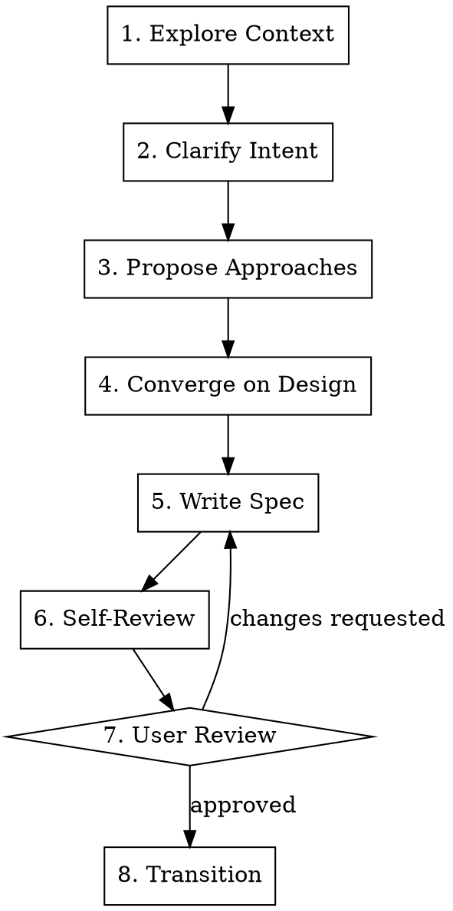

# Brainstorm: Pre-Creation Design Exploration

Explore the problem space, clarify requirements, and converge on a design direction **before** creating
issues. This skill produces a **spec document** — capturing intent, trade-offs, the chosen approach, and
enough detail for both issue creation (`/pm`) and implementation planning (`/cdt`).

## When to Use

Use this skill when:
- The work is ambiguous — user knows *what* they want but not *how*
- Multiple valid approaches exist and trade-offs need discussion
- Scope is unclear — could be one issue or an epic with sub-issues
- The problem domain is unfamiliar and needs exploration first
- A request is large enough that jumping straight to issue creation would produce a vague ticket

Do NOT use for:
- Clear, well-scoped bugs (go directly to `/pm`)
- Simple chores or dependency updates
- Work that already has a design document or spec

## Hard Gate

<HARD-GATE>
Do NOT invoke `/pm`, `/cdt`, create any GitHub issue, or take any implementation action until:
1. You have proposed approaches and the user has selected one
2. You have presented a spec document and the user has approved it

This applies to EVERY brainstorming session regardless of perceived simplicity. A spec can be
short (5-10 lines for a simple feature), but it must exist and be approved.
</HARD-GATE>

### "This Is Too Simple To Need a Spec"

No. Every brainstorming session produces a spec. The spec scales with complexity:
- Simple feature: 5-10 lines covering approach, scope, and key decisions
- Medium feature: half a page with trade-off analysis and component breakdown
- Complex initiative: full spec with architecture, decomposition, and risk assessment

The cost of a 30-second review of a short spec is negligible. The cost of a poorly scoped issue
that an agent executes in the wrong direction is significant.

## Workflow

```text
1. Context → 2. Clarify → 3. Propose → 4. Converge → 5. Write Spec → 6. Self-Review → 7. User Review → 8. Transition
```



### Step 1: Explore Context

Before asking any questions, gather context silently:

1. **Project awareness**: Read the project's README, CLAUDE.md, or similar docs to understand what this project does
2. **Recent work**: Run `git log --oneline -20` to see recent direction
3. **Relevant code**: If the user mentioned a specific area, use `Glob` and `Grep` to survey it
4. **Existing issues**: Run `gh issue list --limit 10 --state open` to check for related work

Do NOT dump this research back at the user. Use it to ask smarter questions in Step 2.

### Step 2: Clarify Intent

Ask clarifying questions to understand what the user actually wants. Follow these rules strictly:

**One question per message.** Never ask more than one question at a time. Wait for the answer before
asking the next question. This forces depth — users give better answers to focused questions than to
a wall of 5 questions at once.

**Prefer multiple choice over open-ended.** When possible, offer 2-4 concrete options rather than
asking "what do you want?" Open-ended questions get vague answers; structured choices get decisions.

**Use your context research.** Frame questions using what you learned in Step 1. Instead of "what part
of the codebase?" ask "I see the auth module uses JWT tokens in `src/auth/` — is this about the token
refresh flow or the login flow?"

**Stop when you have enough.** You need to understand:
- What problem is being solved (the "why")
- Who it's for (users, developers, ops)
- What success looks like (observable outcome)
- What's explicitly out of scope

Three to five questions is typical. Do not over-interrogate — if the user gives a rich initial
description, you may only need one or two clarifications.

### Step 3: Propose Approaches

Present 2-3 distinct approaches. For each approach, include:

1. **Name** — a short label (e.g., "Approach A: Event-driven pipeline")
2. **How it works** — 2-3 sentences describing the approach
3. **Trade-offs** — what you gain and what you give up
4. **Complexity** — rough effort level (small / medium / large)
5. **Risk** — what could go wrong or what's unknown

End with a **recommendation** — state which approach you'd pick and why. Do not be neutral. Take a
position. The user can override, but fence-sitting wastes everyone's time.

**Apply YAGNI ruthlessly.** If an approach adds flexibility "in case we need it later," flag that as
speculative complexity. Propose the simplest approach that solves the stated problem. If the user
wants extensibility, they'll ask.

**Visual comparison (optional).** If the approaches involve architectural differences (data flow,
component structure, system boundaries), use `Skill` to invoke `visual-explainer:generate-web-diagram`
to render a side-by-side comparison diagram. This is especially valuable for:
- Pipeline/workflow designs with different topologies
- Component architectures with different boundaries
- Data flow alternatives (push vs. pull, sync vs. async)

Do NOT generate visuals for trivial choices or when the text description is sufficient. Ask the user
first: "Would a visual comparison of these approaches help?"

Use `AskUserQuestion` to let the user pick:

```text
Question: "Which approach do you prefer?"
Options:
  - Approach A: [name] — [one-line summary]
  - Approach B: [name] — [one-line summary]
  - Approach C: [name] — [one-line summary]
  - None of these — let me describe what I want
```

### Step 4: Converge on Design

With the chosen approach, flesh out the design. Present it in sections scaled to complexity:

**For simple features (1 issue):**
- Approach summary (2-3 sentences)
- Key decisions (bullet list)
- Scope boundary (in/out)

**For medium features (2-3 issues):**
- Approach summary
- Key decisions with rationale
- Component breakdown (what pieces need to change)
- Scope boundary
- Open questions (if any remain)

**For complex initiatives (epic-level):**
- Approach summary
- Architecture overview (components, data flow, interfaces)
- Decomposition into work units (each becomes an issue)
- Dependencies between units
- Scope boundary
- Risks and mitigations
- Open questions

**Visual architecture diagram.** For medium and complex work, generate an architecture diagram using
`Skill` to invoke `visual-explainer:generate-web-diagram`. Show component boundaries, data flow, and
the decomposition into work units. Present the diagram alongside the architecture overview section.

Present each section and wait for the user to confirm before moving to the next. Do NOT present
the entire design at once for medium or complex work.

### Step 5: Write Spec Document

Save the approved design to a file:

```bash
# Ensure the directory exists
mkdir -p .dev/pm/specs
```

**File path:** `.dev/pm/specs/YYYY-MM-DD-<topic-slug>.md`

**Spec format:**

```markdown
# Spec: <Topic>

**Date:** YYYY-MM-DD
**Status:** Approved

## Problem

<What problem are we solving and why — include the user/stakeholder perspective>

## Chosen Approach

**<Approach name>**

<2-3 paragraph description of the approach, how it works, and why it was chosen over alternatives>

### Alternatives Considered

| Approach | Pros | Cons | Why not |
|----------|------|------|---------|
| <Alt 1> | <pros> | <cons> | <reason rejected> |
| <Alt 2> | <pros> | <cons> | <reason rejected> |

### Key Decisions

- <Decision 1>: <chosen option> — <rationale>
- <Decision 2>: <chosen option> — <rationale>

### Trade-offs Accepted

- <What we're giving up and why that's acceptable>

## Scope

**In scope:**
- <item>

**Out of scope:**
- <item>

## Technical Design

<For simple: 2-3 sentences on the approach>
<For medium: component breakdown with interfaces>
<For complex: architecture overview, data flow, key interfaces>

### Files Affected

<List real file paths found during codebase exploration, or "New files" for greenfield>

- `src/path/to/file.ts` — <what changes>

## Work Breakdown

<For simple: skip this section>
<For medium/complex: numbered list of work units with dependencies>

1. <Unit 1> — <what it does, rough size> [no dependencies]
2. <Unit 2> — <what it does, rough size> [depends on: 1]

## Open Questions

<Any unresolved items — or "None" if fully resolved>
```

**Scaling the format:**
- **Simple** (1 issue): Skip "Alternatives Considered" table, "Work Breakdown", and keep "Technical Design" to 2-3 sentences
- **Medium** (2-3 issues): Include all sections but keep each concise
- **Complex** (epic): Full spec — all sections fleshed out, architecture diagram referenced

Commit the spec to git:

```bash
git add .dev/pm/specs/YYYY-MM-DD-<topic-slug>.md
git -c commit.gpgsign=false commit -m "docs(brainstorm): <topic-slug> spec"
```

### Step 6: Self-Review

Before presenting the spec to the user, review it yourself. Check for:

- **Placeholders**: Any "TBD", "TODO", or vague hand-waving? Replace with specifics or mark as
  `[NEEDS CLARIFICATION: question]`
- **Contradictions**: Does the scope say X is out but the work breakdown includes it?
- **Missing rationale**: Every key decision should have a "why" — if one doesn't, add it
- **Scope creep**: Does the work breakdown include items the user didn't ask for? Remove them
- **Feasibility gaps**: Does the approach assume something about the codebase that you haven't
  verified? Use `Grep`/`Read` to confirm
- **File path accuracy**: Do the files listed in "Files Affected" actually exist? Verify with `Glob`

Fix any issues found inline before proceeding.

### Step 7: User Review

Present the final spec to the user. Show:
- The topic and chosen approach (one-liner)
- Key decisions summary
- Scope summary
- Work breakdown (if applicable)

Ask explicitly: **"Spec looks good — approve to proceed, or want changes?"**

If the user requests changes, revise the spec (go back to Step 5) and re-present. Loop until
approved.

### Step 8: Transition

Once approved, present the next steps. The spec at `.dev/pm/specs/YYYY-MM-DD-<topic-slug>.md` is
designed to feed into two downstream workflows:

**Path A: Issue creation (`/pm`)**
> Create structured GitHub issues from the spec. The work breakdown maps directly to issues.

**Path B: Implementation planning (`/cdt:plan-task`)**
> Skip issue creation and go straight to an implementation plan. CDT's architect teammate will
> use the spec as input.

**Path C: Both**
> Create issues first (`/pm`), then plan implementation for the top-priority issue (`/cdt`).

Use `AskUserQuestion` to let the user choose:

```text
Question: "Spec approved. What's next?"
Options:
  - Create issues (/pm) — turn the spec into GitHub issues
  - Plan implementation (/cdt:plan-task) — go straight to implementation planning
  - Both — create issues first, then plan the first one
  - Done for now — I'll come back to this later
```

Do NOT automatically invoke any downstream skill. Let the user choose their path. The spec is
committed to git — they can come back to it in a future session.

## Principles

- **Depth over breadth** — one good question beats five shallow ones
- **Take positions** — recommend an approach, don't just list options
- **YAGNI** — remove speculative features from every design. If they say "might need X later,"
  acknowledge it and leave it out unless there's a concrete use case now
- **Scale the process** — a simple feature gets a 10-line spec, not a 2-page design doc
- **The spec is the contract** — once approved, downstream workflows follow the spec. No
  re-litigating decisions that were already made
- **Visuals earn their keep** — generate diagrams only when they clarify something text cannot.
  A bullet list of 3 components does not need an architecture diagram
